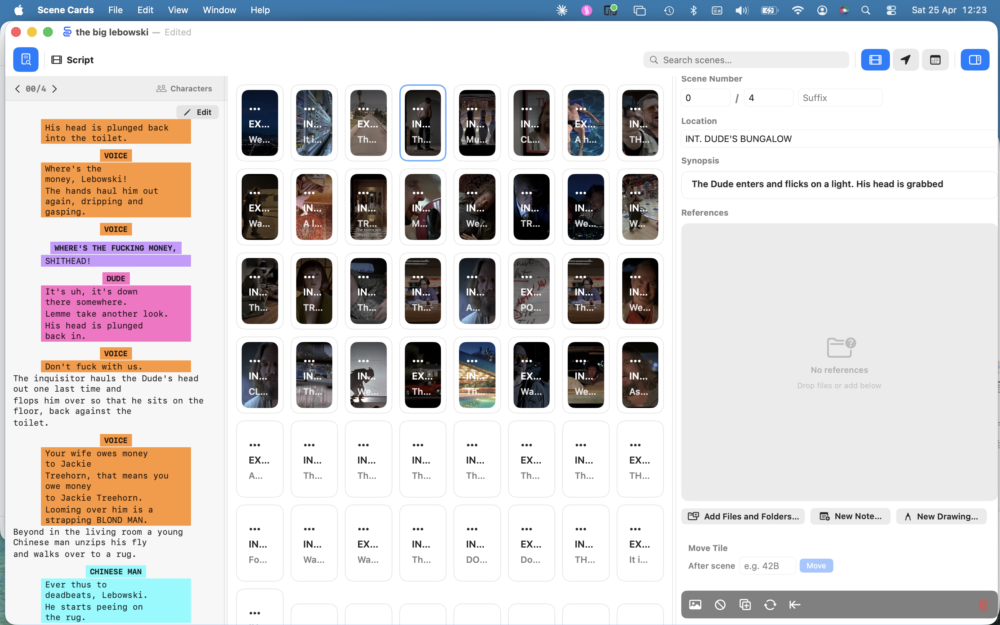

<!--
TODO — still open for this chapter:
  1. Screenshot for §3.2 (iPadOS window overview) still needed.
-->

# Chapter 3 — Orientation

This chapter is a guided tour of the Scene Cards window. Once you have a
document open (Chapter 2), everything you do happens inside one of four
regions: the **toolbar**, the **wall**, the **inspector** and the **script
panel**. 

This chapter describes the interface only. Procedures (importing,
reordering, scheduling) live in their own chapters and are cross-referenced
from here.

## 3.1 The Anatomy of the Window

Every Scene Cards document opens into a three-zone layout:

| Zone | Contents | Platform notes |
|---|---|---|
| **Toolbar** (top) | Mode switcher, search, script / inspector toggles | Inline on both platforms |
| **Wall** (centre) | The grid of cards — the primary work surface | Same on both platforms |
| **Inspector** (right) | Editable details of the selected card | Docked on macOS; sheet on iPadOS |
| **Script panel** (left) | The raw script for the selected card | Docked on macOS; sheet on iPadOS |



On **macOS**, the inspector and script panel dock to the right and left of
the wall and can be open together. On **iPadOS**, both are sheets — opening
one dismisses the other.

> ⓘ **Note** — there is no window-level status bar. The wall's footer is
> reserved for future use; today, the card count and import summaries appear
> as transient overlays where relevant.

## 3.2 The Wall

The wall is the grid of cards that takes up the centre of the window. Each
card represents one scene. The same cards are displayed in all three **wall
modes**, only the ordering changes:

| Mode | Icon | Order | When you use it |
|---|---|---|---|
| **Script** | `film` | Ascending by episode + scene number | Breakdowns, story work, reading through, print scene wall |
| **Location** | `location.fill` | Grouped by location slugline | Scouting, location scheduling, art department planning |
| **Schedule** | `calendar` | Grouped by shoot day (requires a one-liner import) | Daily shoot prep, AD reordering, storing daily reports and essentials |

Switch modes from the toolbar (§3.3). On macOS the same three modes are
also available from the `View` menu as `⇧⌘1` / `⇧⌘2` / `⇧⌘3`.

### 3.2.1 Wall width

- **🍎 macOS** — 8 cards wide by default.
- **📐 iPadOS** — 6 cards wide by default. Pinch to change column count.
- **📱 iPhone** — 3 cards wide in portrait, 5 in landscape by default.
  Pinch to change column count. The count resets to the default when you
  rotate the device; pinch again in the new orientation to adjust.

### 3.2.2 Card appearance

Each card shows:

- The **still image**, if one has been attached.
- The **scene number** and **episode** in the top-left corner.
- The **brief** (one-line summary) along the bottom edge.
- A coloured stripe reflecting the **revision colour** (white, blue, pink,
  yellow, green, goldenrod…).
- A badge when the scene is **omitted** or marked as **no-shoot**.

A card with no still shows a placeholder silhouette and the scene's
slugline instead — it's a perfectly valid state, not an error.

### 3.2.3 Empty slots

The wall always shows at least one page of empty slots after the last
populated card. Empty slots let you drag a card into open space or insert
a new scene with `File → Insert Tile After` (`⌥⌘N`).

## 3.3 The Toolbar

### 3.3.1 🍎 macOS toolbar

Left to right:

```
[ Script panel ] | [ Mode label ]              [ Search ]  |  [ Script | Loc | Sched ]  |  [ Inspector ]
```

- **Script panel toggle** (`doc.text.magnifyingglass`) — opens or closes
  the script panel on the left. Highlighted blue when open.
- **Mode label** — the name and icon of the current wall mode. This is a
  label only; to change mode, use the mode buttons on the right.
- **Search field** — filters the wall live as you type. Matches against
  scene number, brief, description, comments and `episode/scene`
  syntax (see §3.3.3).
- **Mode buttons** — one button per wall mode. The active mode is tinted
  with the accent colour.
- **Inspector toggle** (`sidebar.right`) — opens or closes the inspector
  panel on the right. Highlighted blue when open.

> ✱ **Tip** — hover over any toolbar button to see a tooltip describing
> what it does.

### 3.3.2 📐📱 iPadOS and iPhone toolbar

Left to right:

```
[ ← Back ] [ Script panel ] [ ··· ]    [ 🔍 Search ]   [ mode ]   [ Inspector ]
```

- **Back** (`chevron.backward`) — returns to the Files browser. The
  document saves on the way out.
- **Script panel toggle** (`doc.text.magnifyingglass`) — opens the script
  panel as a sheet.
- **Overflow menu** (`···`) — houses actions that live in macOS menus:
  - Undo
  - Import Script PDF or FDX…
  - Open Project…
  - Import Images from Files…
  - Import from Photos…
  - Import Sound Reports from Folder…
  - Print…
- **Search** — starts as a magnifying-glass button; tap to expand into a
  full text field, tap the ✕ (or submit) to collapse. The icon turns blue
  while a query is active.
- **Mode button(s)**
  - **📐 iPad** — three individual buttons, one per mode. The active mode
    is tinted with the accent colour.
  - **📱 iPhone** — a single button showing the current mode's icon. Tap
    it to open a menu and select Script, Locations or Schedule.
- **Inspector toggle** — opens the inspector as a sheet.

> ⓘ **Note** — neither iPadOS nor iPhone has a menu bar, so all actions
> are reachable from the toolbar or the overflow menu. (Schedule mode also
> attaches a context menu to each card for day-assignment actions — see §9.)

### 3.3.3 Searching

The search field is live — results update as you type. Matching rules:

| You type | Interpreted as |
|---|---|
| `beach` | Text match against brief, description, comments and scene numbers |
| `15/` | Every card in **episode 15** (any scene) |
| `15/36` | **Episode 15, scene 36** — prefix match, so `1/1` also matches `1/10`, `1/11`, etc. |
| `42` | Any scene whose number, brief or description contains `42` |

Clear the query with the ✕ button in the field. The wall restores its full
contents immediately.

## 3.4 The Inspector Panel

The inspector is the right-hand pane (or sheet) where you edit one card at
a time. It only shows content when a single card is selected.

Open it from the toolbar's inspector button (§3.3) or by double-clicking
(macOS) / double-tapping (iPadOS) a card.

Fields, top to bottom:

- **Scene Number** — three fields: **Episode / Scene / Suffix**.
- **Location** — the slugline; auto-uppercased.
- **Synopsis** — free-form notes on the scene.
- **References** — carousel of attached reference files.
- **Move Tile** — reposition this card after another scene by number.
- **Toolbar strip** — Import Image, Omit/Unomit, Insert After, Renumber
  From Here, Close Gap, Delete.
- **Shoot Data** — sound / camera / continuity entries, shown only when
  they exist.

A full walkthrough of each field lives in §6 *Working with Scenes*.

> ⓘ **Note** — script-derived values (scene heading, revision colour,
> raw script text) come from the import and are not edited from the
> inspector. Day-level shoot reports (call sheets, camera, continuity,
> essentials) live in **Schedule mode** alongside each shoot day — see
> §10.

### 3.4.1 Closing the inspector

- **🍎 macOS** — click the inspector button in the toolbar to toggle it
  closed. It stays closed for subsequent documents until you reopen it.
- **📐 iPadOS** — swipe the sheet down, or tap the inspector button
  again.

## 3.5 The Script Panel

The script panel is the left-hand pane (macOS) or a sheet (iPadOS) that
shows the **raw script text** for the currently selected card. It is read-
only — Scene Cards is not a screenwriting tool — but it recognises and
formats:

- Scene **headings** (sluglines)
- **Character** cues
- **Dialogue** blocks
- **Action** paragraphs

Characters have per-document colour assignments. Where a name has a colour
(either automatic or manually set — see §6.3), that colour is applied to
the character cue so you can scan dialogue-heavy scenes at a glance.

Click or tap a character name in the script panel to open the colour
assignment popover for that character.

> ✱ **Tip** — the script panel follows your wall selection. Click another
> card and the script updates; click nothing and the panel shows a brief
> placeholder.

### 3.5.1 When the script panel is useful

- Reading a single scene in full while reviewing the card's still and
  references.
- Quickly checking which characters appear in a scene before assigning
  colours.
- Spot-checking a parser import — if a scene's text looks wrong, re-import
  from a cleaner PDF (see §5.1).

## 3.6 Selecting, Zooming and Scrolling

### 3.6.1 Selection

- **Single click / tap** — selects one card. The card gets a blue border.
- **⇧ click** (macOS) — extends the selection to include a range.
- **⌘ click** (macOS) — toggles individual cards in and out of the -- this is not working like this at the moment but maybe it should as is more standard for shift click range and Apple click selection - needs looking at---
  selection. The anchor card shows a blue count badge.
- **Double-click / double-tap** — opens the inspector for the card.
- **Long-press (📐 iPadOS)** — picks the card up for drag-to-reorder in
  Script and Location mode. In **Schedule mode** a long-press opens the
  day-assignment menu — see §9.
- **Drag (🍎 macOS)** — click and hold, then drag to reorder.

Scene Cards does not ship a right-click / context menu on plain wall cards.
Scene-level actions (**Insert Tile After**, **Toggle OMITTED**,
**Renumber From Here**, delete) are reached through the inspector's
toolbar, the `Edit` menu on macOS, or the keyboard shortcuts listed in
§16.

Most wall-wide operations (changing revision colour, bulk omit, bulk
delete) apply to every card in the current selection.

> ⓘ **Note** — the **Schedule mode** has its own selection semantics tied
> to day blocks rather than individual cards. See §9 *Scheduling*.

### 3.6.2 Zooming

- **🍎 macOS** — adjust wall width via `View → Wall Width` (see §17.2). A, - i'm not sure we have this---
  trackpad pinch is not currently mapped to column count on macOS.
- **📐 iPadOS** — pinch the wall with two fingers. Pinch **outward** to
  pack more cards per row; pinch **inward** to make each card larger.
  The column count animates live and persists until you rotate the device.
- **📱 iPhone** — same pinch gesture. The column count persists until you
  rotate; rotating resets to the orientation default (3 portrait, 5
  landscape), after which you can pinch again to adjust.

### 3.6.3 Scrolling

- **🍎 macOS** — standard scroll wheel or trackpad two-finger gesture.
- **📐 iPadOS** — standard swipe. Cards lazy-load as they come into view,
  so very long walls stay responsive.

When you switch wall modes, Scene Cards scrolls the new view to the
currently selected card automatically, so you don't lose your place moving
between Script, Location and Schedule. If no card is selected, the new
mode opens at the top. 

## 3.7 Where to Go Next

- **Organise the wall** — see §5 *Building the Wall*.
- **Fields inside the inspector** — see §6 *Working with Scenes*.
- **Keyboard shortcuts reference** — see §16.
- **Toolbar and menu reference** — see §15.
