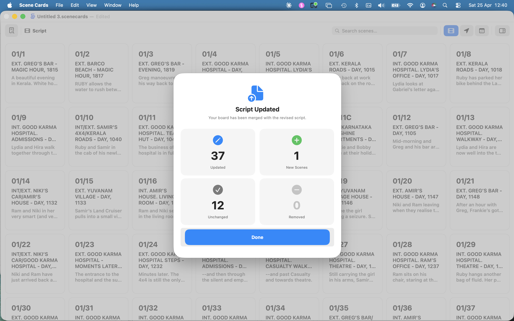

<!--
TODO — still open for this chapter:
  1. Screenshots for §5.4 renumber-from-here, §5.3 drag-to-reorder.
-->

# Chapter 5 — Building the Wall

Once a document exists (Chapter 4), the work of building it starts — pull
a script in, shuffle the cards into the order you want, mark omissions,
assign revision colours, spin up an extra scene when the director dreams
one up on set. This chapter covers every wall-level operation that does
not touch an individual card's fields (those live in §6) or the schedule
(§9).

## 5.1 Importing a Script

A script import walks the PDF or FDX top-to-bottom, finds every scene
heading, and creates one card per scene. The basic procedure is in §2.2 —
this section covers **re-imports** (bringing a revised draft into a
document that already has cards), which behave differently from a fresh
import.

### 5.1.1 First import vs. re-import

Scene Cards decides which mode to use based on the document's current
state:

| Situation | Behaviour |
|---|---|
| Document has **no cards yet** | **Fresh import** — the wall is populated from scratch, cards are laid out in script order. |
| Document **already has cards** | **Episode-scoped merge** — see §5.1.2. |

A fresh import is the case Quick Start walks you through (§2.2). The
merge path only runs once the wall is non-empty.

### 5.1.2 How a re-import merges

When you import a script into a document that already has cards, Scene
Cards runs an **episode-scoped merge** rather than a wipe-and-rebuild.
Cards are matched on **episode + scene number + scene suffix**:

| Situation | Outcome |
|---|---|
| Matching card exists | **Updated in place** — brief, location, script text, revision colour and description are replaced with the new draft's values. Stills, references, sound reports, shoot-day assignments, omission state and slot position are preserved. |
| New scene in the draft | **Added** — appended to the wall in script order. |
| Old scene no longer in the draft | **Deleted** — along with anything attached to it (stills, references, sound entries). Counted as *removed* in the summary. |
| Episode not in this import batch | **Untouched** — cards in other episodes are not scanned. |

A summary sheet shows **Added / Updated / Unchanged / Removed** counts
before the merge commits.

> ⚠ **Caution — Re-importing a revised script**
>
> Script-derived fields (brief, location, script text, revision colour)
> are always overwritten by the new draft's values, so any manual edits
> to those fields will be lost. Scenes dropped from the new draft are
> deleted together with anything attached to them.

> ✱ **Tip** — the whole merge is registered as a single undo step
> (`Import Script`). `⌘S`'s safer cousin is `⌘Z` — if the summary looks
> wrong, hit Undo before you carry on.

### 5.1.3 Importing several episodes at once

The Open panel accepts multi-select. Pick every episode in one go and
Scene Cards imports them as a single batch. For episodic productions
this is the fastest way to seed a document — see §13
*Multi-Episode Productions* for the full story.

### 5.1.4 When scene numbers look wrong

The parser reads the number printed in the scene heading. A heading with
no number, or a number the parser cannot detect, becomes a card numbered
from its position in the script (1, 2, 3…). Fix these after import using
**Renumber From Here** (§5.4.2) rather than re-importing.

## 5.2 Manually Inserting a Scene

You will often need a new scene that is not in the script — a director's
addition on set, a cover pick-up, an omitted scene reinstated under a
suffix.

### 5.2.1 Insert a new card after another

- **🍎 macOS** — select the card you want the new one to follow, then
  choose `Edit → Insert Tile After` (`⌥⌘N`). You can also use the
  **Insert Tile After** button in the inspector's toolbar.
- **📐 iPadOS** — select the card, tap the inspector button, and tap
  **Insert Tile After** in the inspector's toolbar.

The new card is blank: episode 1, next unused scene number, no brief.
Edit its fields in the inspector (§6).

### 5.2.2 Insert into an empty slot

Drag any card onto an empty slot at the end of the wall to move it there.
An empty slot does not hold a card until something is dropped into it —
it is just a gap where the wall has room to grow.

> ⓘ **Note** — Scene Cards keeps at least one page of empty slots past
> the last populated card so there is always somewhere to drop.

## 5.3 Reordering Cards

### 5.3.1 Drag a single card

- **🍎 macOS** — click and drag a card to a new position. The wall makes
  space as you hover over an occupied slot.
- **📐 iPadOS** — long-press a card to pick it up, then drag. Lift your
  finger on the target slot to drop.

A drop onto an occupied slot shuffles the cards between source and
destination — nothing gets clobbered.

### 5.3.2 Drag multiple cards

Select several cards (§3.6.1) and drag the anchor card — the rest follow.
The relative order of the selected cards is preserved.

### 5.3.3 Close a gap

If a card has been deleted from the middle of the wall, the gap persists
until you close it.

- **🍎 macOS** — right-clicking a card used to surface **Close Gap**; the
  current build routes gap closing through the inspector toolbar. Select
  the card immediately after the gap and click **Close Gap** in the
  inspector.
- **📐 iPadOS** — select the card immediately after the gap and tap
  **Close Gap** in the inspector toolbar.

Closing a gap pulls every later card up by one slot. It does not
renumber — for that, see §5.4.2.

## 5.4 Numbering and Suffixes

Scene numbers in Scene Cards are independent from slot order. A card at
slot 12 might be scene 10A because a suffix scene sits between 10 and 11.

### 5.4.1 Scene numbers

Every card has:

- **Episode** — an integer (`1`, `2`, `101`…). Used across the wall for
  grouping and display.
- **Scene Number** — an integer.
- **Scene Suffix** — an optional string (`A`, `B`, `AA`…). Cards with a
  suffix share their *base* scene number with the preceding un-suffixed
  card.

Edit any of these fields in the inspector (§6). Scene Cards recomputes
the display format (`EP/SCENE[SUFFIX]`) as you type.

### 5.4.2 Renumber From Here

When scene numbering has drifted — say you imported an early draft and
the numbers no longer match the shooting script — use **Renumber From
Here** to resync:

- **🍎 macOS** — `Edit → Renumber From Here` (`⌥⌘R`).
- **📐 iPadOS** — select the starting card and tap **Renumber From Here**
  in the inspector toolbar.

The command walks the wall from the selected card onward and rewrites
numbers using these rules:

| Encountering… | Action |
|---|---|
| A normal card | Assign the current base, then increment the base (`27` → `28`). |
| A card with a suffix (`A`, `B`…) | Assign the current base *without* incrementing, so it shares with the card before it (`28A`, `28B`). |
| An **OMITTED** card | Assign the current base and strip any suffix, then increment. |

Renumbering only affects cards from the selected one onward. Earlier
cards are untouched. Renumbering is a single undo step.

### 5.4.3 Scene suffixes

Suffixes are free-form strings — the common choices are single letters
(`A`, `B`) or doubled letters (`AA`) for cascading additions. Mark a
card as a suffix scene by editing the **Scene Suffix** field in the
inspector.

> ⓘ **Note** — Scene Cards does not validate suffix characters. If you
> use `1`, `!` or an emoji, the wall will render it. Stick to letters if
> you want the display to match industry convention.

## 5.5 Omitting a Scene

When a scene is dropped from the shoot but you do not want to lose its
record — stills, references, sound notes — mark it **OMITTED** instead
of deleting it.

- **🍎 macOS** — select the card and choose `Edit → Toggle OMITTED`
  (`⌥⌘O`), or tap the **Omit** (`nosign`) button in the inspector's
  toolbar strip.
- **📐 iPadOS** — open the inspector and tap the **Omit** button in its
  toolbar strip.

An omitted card shows an `OMITTED` pill on the wall and is excluded from
scheduling. It still counts toward the base scene number — see the
renumber rules in §5.4.2.

Toggling **OMITTED** on also clears any **scene suffix** for tidiness.
Toggling it off leaves the suffix empty — re-enter one if you need it.

## 5.6 Deleting a Scene

Deletion is the last-resort option. It removes the card, its still, its
reference files and its sound entries. If there is any chance the scene
comes back, use **OMITTED** instead (§5.5).

- **🍎 macOS** — select the card and press the **delete** key, or use
  the inspector's **Delete** button.
- **📐 iPadOS** — tap the inspector's **Delete** button.

Delete leaves an empty slot in place. Close it with **Close Gap**
(§5.3.3) once you are sure the deletion is final.

> ⚠ **Caution** — deletion is a single undo step, but once the document
> is saved and closed the attached media is gone with it. The file copy
> inside the package is removed on the next write, not on delete. A
> duplicate of the document (§4.5.2) is cheap insurance before a bulk
> delete.

## 5.7 Revision Colours

Revision colours match the industry shooting-script convention: each
round of revisions ships on a named paper colour, and cards track which
revision they last changed on.

### 5.7.1 Palette

Scene Cards recognises the following Final Draft revision colours:

`white`, `blue`, `pink`, `yellow`, `green`, `goldenrod`, `buff`,
`salmon`, `cherry`, `tan`, `lavender`, `lime`, `orange`.

A card's revision colour renders as a coloured dot in the top-right of
the card and as a coloured stripe along the edge.

### 5.7.2 How a card gets a revision colour

Revision colours are **read from the script**, not set by hand:

- **PDF imports** — Scene Cards detects the coloured-paper label
  (*white draft*, *blue revisions* etc.) from the cover page or header
  and applies it to every scene in the file.
- **FDX imports** — each scene's `RevisionID` attribute is cross-
  referenced against the document's `<Revisions>` block, so different
  scenes in one draft can carry different colours.

A card's revision colour is fixed until the next import of that scene,
which overwrites it with whatever colour the new draft carries.

> ⓘ **Note** — there is no in-app picker for revision colour. To change
> a card's colour, re-import from a script that carries the correct
> metadata (§5.1). If your writer's PDF doesn't label revisions by
> colour, the cards stay uncoloured.

## 5.8 Working Across Episodes

A single document can hold every episode of a series. For a cross-
episode production:

- Each card carries its own **episode** number.
- Cards are grouped by episode in every wall mode (§3.2).
- Script imports are **episode-scoped** — re-importing episode 3 does
  not touch episodes 1, 2, 4 or 5 (§5.1.2).
- **Renumber From Here** stays within the selected card's contiguous
  slot run — it does not reach across episode boundaries unless the
  slots are contiguous.

For the full multi-episode story — setting episode numbers in bulk,
displaying cross-episode totals, printing episodic wall sections — see
§13.

## 5.9 Where to Go Next

- **Edit a card's fields** — see §6 *Working with Scenes*.
- **Add stills and thumbnails** — see §7.
- **Attach reference files** — see §8.
- **Assemble a shoot-day schedule** — see §9.
