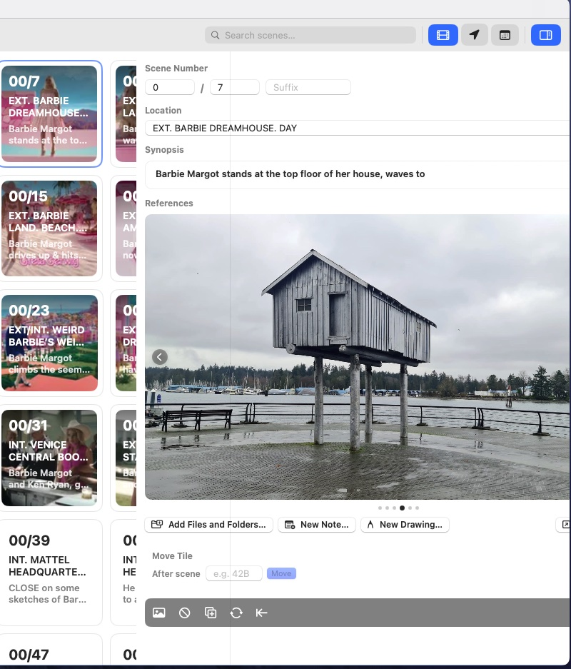
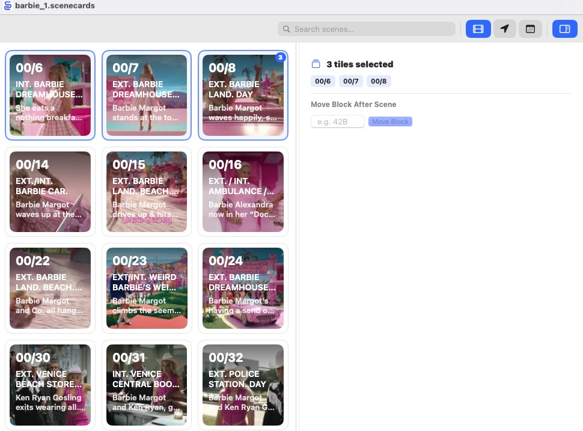

<!--
TODO — still open for this chapter:
  1. Screenshot of the Shoot Data block expanded still needed.
  2. Confirm the character colour assignment popover actually opens on
     tap on both platforms (confirmed in §6.5 below but not screenshotted). *confirmed*
  3. Cross-check §6.8 field list against any future report types added
     to `ShootReportType`. **at the moment shoot data is confined to sound only as these are the only sheets we can successfully parse**
-->

# Chapter 6 — Working with Scenes

This chapter covers the per-scene edits you make inside the **Inspector**
panel, and one task that lives in the **Script Panel**: character colour
assignment. Wall-level operations (insert, reorder, omit, delete, renumber)
live in §5; stills and references each have their own chapter (§7 and §8).

---

## The Inspector

## 6.1 Opening the Inspector

Select one card and open the inspector:

- **🍎 macOS** — double-click the card, or click the **Inspector** button
  in the toolbar.
- **📐 iPadOS** — double-tap the card, or tap the **Inspector** button in
  the toolbar.

With no card selected, the inspector reads *"Select a tile to edit."*
With more than one card selected, it switches to the **Multi-Select
Panel** (§6.8).



Edits are committed as soon as a field loses focus — there is no Save
button. Each commit is a single undo step (`⌘Z`).

## 6.2 Scene Numbering

The **Scene Number** block sits at the top of the inspector. It is three
text fields joined by a `/` separator:

```
[ Episode ] / [ Scene ] [ Suffix ]
```

- **Episode** — integer (`1`, `101`…).
- **Scene** — integer.
- **Suffix** — optional string (`A`, `B`, `AA`…). Auto-uppercased when
  you commit.

Editing any of the three rewrites the card's identity. Numbering is
independent from slot order, so changing the number does not move the
card; to resync numbering with the wall order, use **Renumber From Here**
(§5.4.2).

> ⓘ **Note** — two cards can legally share a number if one of them uses
> a suffix (`7` and `7A`). Two cards with the exact same `episode +
> scene + suffix` combination is not prevented but is a symptom of a
> broken import — fix it before it confuses the merge logic on the next
> re-import (§5.1.2).

## 6.3 Location

The **Location** field holds the slugline — the text after `INT.` /
`EXT.` in the scene heading.

- Auto-uppercased as you type.
- Autocorrect is disabled — sluglines routinely use abbreviations and
  proper nouns that spellcheck would mangle.
- In **Locations** mode (§3.2), cards are grouped by this exact string.
  Typos create new groups, so be consistent: `INT. OFFICE` and
  `INT.OFFICE` are different locations.

> ✱ **Tip** — after a script re-import, location strings are overwritten
> with the new draft's values (§5.1.2). Let the importer set them;
> manual edits are erased on the next merge.

## 6.4 Synopsis

The **Synopsis** field is a free-form multi-line text editor. It shows
on the wall as the card's secondary text and survives re-imports
untouched (unlike the heading fields in §6.3).

What goes in Synopsis is up to you — some productions put:

- A two-line dramaturgical beat (the "what happens" of the scene).
- The director's shot intent for that day.
- A reminder about character intent or continuity.

On a fresh import from a PDF, the first action line of each scene is
pre-filled here as a starting point — edit or clear it as you like.

> ⓘ **Note** — the inspector calls this field **Synopsis**; in earlier
> builds it was labelled **Comments**. Both terms refer to the same
> underlying data (`tile.comments` in the file format — see §18).

## 6.5 Moving a Card to a Specific Scene

The **Move Tile** panel sits beneath the references carousel. It
repositions this card *after* another card, looked up by scene number.

1. Type a scene number into the **After scene** field (e.g. `42B`).
2. Press **Move**.

If the target is found, the card hops to the slot immediately after it
and a green confirmation appears for a couple of seconds. If the scene
number does not exist in the document, you'll see *"Scene X not found"*
and nothing changes.

The target scene can be in any episode — Scene Cards searches the whole
document. This is the fastest way to reposition a card across a large
wall without dragging through hundreds of slots.

## 6.6 The Inspector Toolbar Strip

Under the references carousel sits a strip of six icon buttons. All
of them act on the currently selected card.

| Icon | Action | Detail |
|---|---|---|
| 🖼 | Import Image | Opens the image picker to set a still on this card (§7.2). |
| 👁 | Omit / Unomit | Toggles OMITTED. Clears any suffix when turning omit ON (§5.5). |
| ＋ | Insert Tile After | Adds a blank card in the slot after this one (§5.2). |
| 🔄 | Renumber From Here | Walks the wall from this card onward and re-issues scene numbers (§5.4.2). |
| ← | Close Gap | Pulls every later card up one slot (§5.3.3). |
| 🗑 | Delete | Permanently removes the card and its attached media. Requires confirmation. |

> ⚠ **Caution** — **Delete** cannot be undone once the document is
> saved and closed. Use **Omit** for any scene that might come back.

## 6.7 Shoot Data

When a card carries at least one sound report entry, a **Shoot Data**
block appears between the toolbar and the bottom of the inspector.

Each row summarises one report type on one shoot day:

```
🎧 Sound · Day 04 · 6 takes          [▾]
```

Tap or click the row to expand it and see every entry — slate, take,
wild-track flag, timecode, notes. Collapse again by tapping the row a
second time.

Shoot Data is read-only inside the inspector; entries are added through
the shoot-report import flow (§10.2).

> ⓘ **Note** — at present, only Sound reports populate Shoot Data.
> Camera and continuity reports are stored as day-level attachments
> rather than parsed entries (§10.3).

## 6.8 Editing Multiple Cards at Once

Select two or more cards (§3.6.1) and the inspector switches to the
**Multi-Select Panel**:

- **Header** — `N tiles selected` with a stack icon.
- **Scene list** — a horizontal strip of the selected cards' scene
  numbers, so you can double-check what's in the selection.
- **Move Block After Scene** — type a target scene number and press
  **Move Block** to insert the whole selection, in its current order,
  immediately after that scene.



Nothing else can be edited in multi-select — per-scene fields (location,
synopsis, scene number) require a single selection, since they take
different values on every card.

> ⓘ **Note** — the target scene must be *outside* the selection. Moving
> a block onto one of its own cards is rejected with *"Target is inside
> the selection"*.

---

## The Script Panel

## 6.9 Character Colours

The **Script Panel** (§3.5) shows the raw text extracted from the
script PDF. It doubles as the interface for assigning colours to
characters — open it with the 🔍 button on iPadOS, or via the left
sidebar toggle on macOS.

- Click (🍎) or tap (📐) a character name in the script panel to open
  a colour popover.
- Pick a colour; the cue recolours across every scene that character
  speaks in.
- To clear a character's colour, reopen the popover and tap **Remove**.

Two kinds of colour are in play:

| Type | Persistence | Who sets it |
|---|---|---|
| **Manual** | Saved in the document | You — always wins when both are present |
| **Auto** | Session only, never saved | Scene Cards, when a character appears in the currently selected scene |

Auto colours keep the script readable even before you've named each
character; manual colours override them when you want something specific.

> ✱ **Tip** — a character removed via **Remove** stays excluded: auto-
> population will not re-add them. Reopen the popover and pick a colour
> to bring them back into rotation.

---

## 6.10 What the Inspector Does *Not* Edit

A deliberately short list so you stop looking:

- **Revision colour** — set by the script importer only (§5.7).
- **Raw script text** — set by the importer; viewed in the Script Panel
  (§3.5) but not editable there either.
- **Scene heading / slugline** as it appears on the card (the big text
  under the scene number) — also set by the importer.

Everything on the list arrives from the PDF or FDX. To change any of
them, bring in a revised draft (§5.1).

## 6.11 Where to Go Next

- **Rearrange the wall** — see §5.
- **Attach a still** — see §7.
- **Attach references** — see §8.
- **Add a shoot report** — see §10.
- **Schedule a card onto a day** — see §9.
