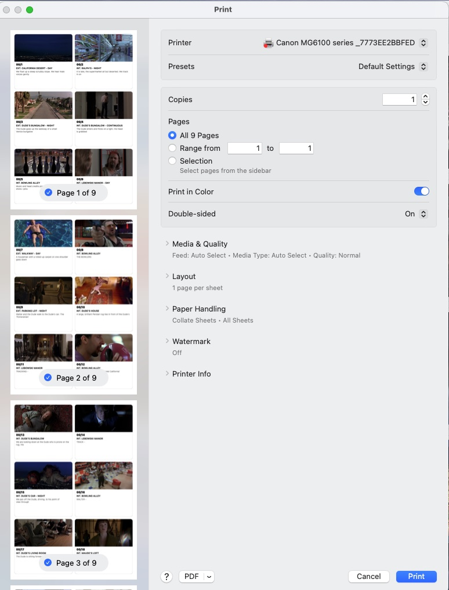

<!--
TODO — still open for this chapter:
  1. Screenshot still needed: the iPadOS print sheet.
  2. RESOLVED — omitted cards are skipped by default ("Skip omitted
     scenes" toggle, on by default). When the toggle is off they print
     with their OMITTED label, e.g. "02 / 15A OMITTED".
-->

# Chapter 11 — Printing

Scene Cards can print the scene wall as a grid of cards. You choose
between six cards per A4 page or one card per A6 sheet. The printout is
useful for pinning to a physical wall, sharing with crew, or sending as
a PDF. This chapter covers starting a print job, what appears on each
card, saving to PDF, and what cannot be printed in the current version.

## 11.1 Printing the Wall

### 11.1.1 Starting a print job

Three routes reach the print dialog:

| Route | Action |
|---|---|
| Menu | `File → Print Wall Layout…` |
| Keyboard | `⌘P` |
| 📐 iPadOS toolbar | **⋯** → **Print…** |

Both platforms open the standard system print dialog — macOS shows the
native print panel; iPadOS shows the print sheet. From there, choose a
printer, set the number of copies, and print.

### 11.1.2 What each card shows

Each printed card contains, from top to bottom:

| Element | Notes |
|---|---|
| Still image | Fills whatever height the text below leaves over; absent if no still is attached |
| Scene number | Episode and scene (e.g. `02 / 15`, `02 / 15A OMITTED`) — omitted cards are skipped by default; when included (§11.1.3) they print with their OMITTED label |
| Scene heading | The full script heading (e.g. `INT. OFFICE — DAY`), never truncated; falls back to the Location field if the card has no heading |
| Action | Up to four lines, in smaller grey text |

When a card has a still, the text is measured first and the image
absorbs the remaining height — a long heading shrinks the image rather
than being cut off. The image always keeps at least 30% of the card.

Card borders are rounded. The background is white. There is no colour
coding in the current print layout — revision colours and badge icons
do not appear.

### 11.1.3 Print options

When you start a print job, an options sheet appears before the system
print dialog.

**Layout** — choose one of two layouts:

| Layout | Paper | Grid | Use case |
|---|---|---|---|
| **6 per page** | A4 portrait (210 × 297 mm) | 2 columns × 3 rows | Overview sheets, pinning to a physical wall |
| **1 per page** | A6 (105 × 148 mm) | 1 card per sheet | Index-card-sized handouts, sorting on a desk |

**Skip omitted scenes** — on by default. Filters OMITTED cards out of
the printout so they don't clutter the wall. Turn it off to print
omitted cards with their OMITTED label.

**Episodes** — shown only when the document contains more than one
episode. Tick the episodes to include; at least one must be selected
before **Print** is enabled.

Both layouts print cards in wall slot order (the same left-to-right,
top-to-bottom order you see in Scenes mode). Margins run to the
printable area edge.

### 11.1.4 Which mode to be in

The print job always uses the **Scenes mode wall grid**. Switch to
Scenes mode (`⌘⇧1`) before printing.

> ⓘ **Note** — Schedule mode and Locations mode are not printable in the
> current version. The print command is available from any mode, but the
> output is always the Scenes wall. To print a shoot schedule, print
> the one-liner PDF directly from its source app.

## 11.2 Saving to PDF

There is no dedicated "Export PDF" command. Use the system print dialog
instead:

**🍎 macOS** — in the print dialog, click the **PDF** pop-up menu at the
bottom-left and choose **Save as PDF…**. Name the file and save.

**📐 iPadOS** — in the print sheet, pinch to zoom the preview — this
converts the job to a PDF in a preview sheet. Tap the share button (⬆)
to save to Files, send by AirDrop, or attach to an email.

The resulting PDF matches whichever layout you chose — six cards per A4
page or one card per A6 page, in slot order.

## 11.3 Where to Go Next

- **Sharing the document itself** — the `.scenecards` package can be
  shared directly from the Files app (📐 iPadOS) or Finder (🍎 macOS).
  See §4.7.
- **Reference files** — stills and documents attached to cards do not
  appear on the printed wall. To share them, use the share sheet in the
  inspector (§8.4.4).
- **Import Project Data** — to hand off a wall to a colleague as a
  Scene Cards document, see §12.
